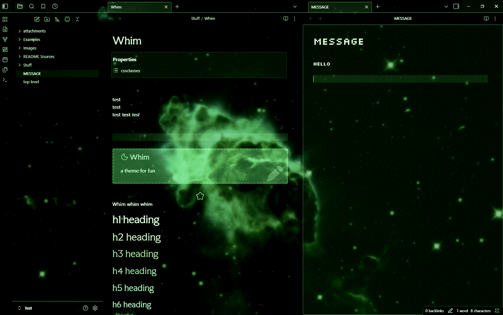
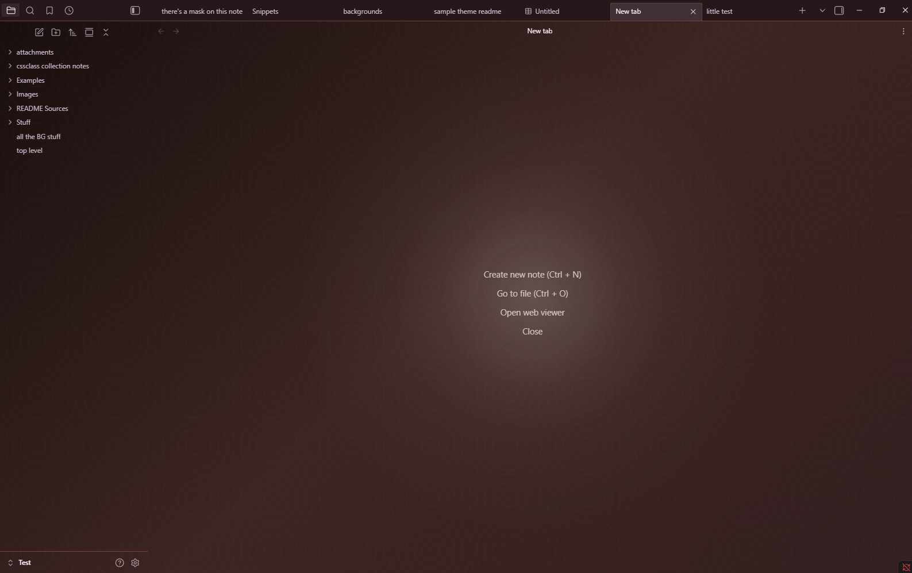
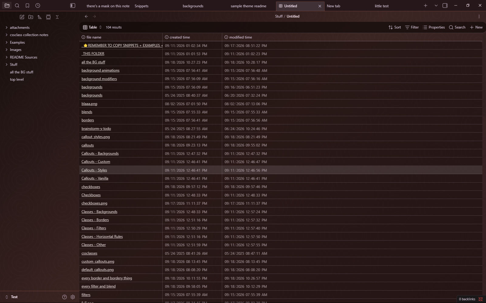
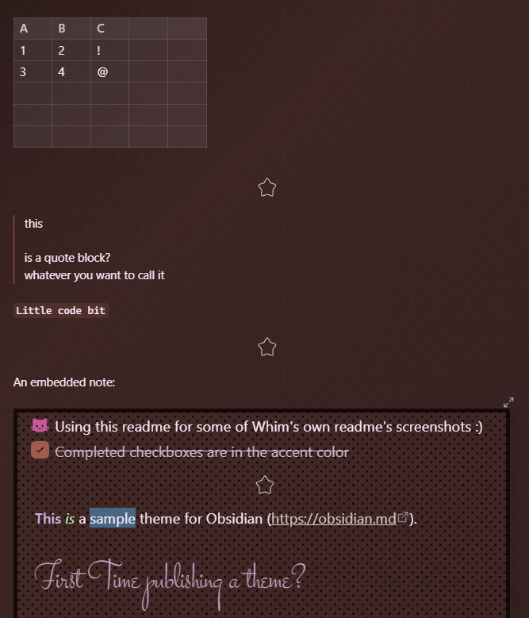

# Welcome to Whim!
---

> This is a note made purely from elements included within Whim.
> (Vector images pictured are from user GDJ on pixabay.)
---

> Vanilla Whim

> (NOTE: Many other screenshots of Whim include a solid color background for the top tab bar and the ribbon, which has since been removed; both are now transparent, revealing the app background, as shown here.)
---

> Whim dressed up
---

> Whim with a cute note (snippets-or-Style Settings must be used for some of what's pictured for cuteness)
---

> The Whim has you (snippets-or-Style Settings must be used for much of what's pictured for terminal-like effect) 
---
---
# Overview
- **For people who love colors** 🌈
	- Pick an accent color -> get a colorful theme with your chosen accent color as the primary color and a contrasting color for accents.
		- If you pick a low-saturation or dark color, the resulting palette won't be THAT colorful. And there's snippets/settings/cssclasses for making things grayer. It's up to you!
	- This doesn't use any specific, pre-documented way to choose colors that go well with the chosen accent color. I just eyeballed what looked good enough to me.
		- One optional snippet shifts the hues in the opposite direction from the accent color as the default theme approach.
		- Another optional snippet shifts the hues less.
- **For people who love doohickeys** ⚙️
- **Not minimalistic** 🌌
	- This theme was def not designed with minimalism in mind. You could *choose* to use it in a somewhat ~minimal fashion...but then why wouldn't you just use a different theme?
- **Supports, dare I say, whimsy** 🪄
	- Make your notes as eye-pleasing or as eye-hurting as you want
	- Maybe evokes scrapbooking energy
	- Or something like updating your MySpace/Neopets/Gaia Online profile
	- Make your notes look wildly different from each other if you desire
	- Core aesthetic is inspired by art nouveau and woodblock prints, but you can do some more cyber/neon-y type stuff too
- **Dark mode first** 🌃
	- There's a light mode, but YMMV with that fellow. It's far from fully tested, and some cssclasses, snippets, etc., will not play nice with light mode.
- **Desktop first** 🖥️
	- I use Obsidian mobile regularly, but this theme was not built for mobile use in particular, and mobile use hasn't been tested much yet. In my experience, this theme is *usable* on mobile, but many of its more fun features do not work properly.
- **Large...** 💪
	- Some illustrations that were included in theme in my initial version have been removed to try to get the theme under Obsidian's maximum size limit for community submission. While the note cssclasses, settings, etc., remain in the theme, the actual SVG data has been moved to snippets which must be downloaded and turned on before those will take effect. Illustrations affected so far:
		- artnouveau2
		- artnouveau12
		- castle
		- compass
		- corner
		- dots
		- flowers
		- halftone
		- hand
		- woman1
	- It is a to-do item of mine to provide additional documentation on the illustrations offered via snippet and to add a separate setting/set of settings to the Style Settings for this theme for interacting with the illustrations whose sources are snippet-only. This could result in a significant restructuring of the theme, but it should have little impact on the user. :-)
---

> Whim of two worlds: the future (simple scanline effect) and the past (combo embossing effect)
---

> Whim thinking about space (snippets-or-Style Settings must be used for some of what's pictured for space thoughts)
---

> Whim that has been training for 1000 years (in three accent color examples)
---

> Whim feeling old-fashioned, or perhaps in half-mourning (snippet required for this note background)
---

> Whim influenced by pop art (snippets-or-Style Settings in use)
---
---
# Features
- **MANY CSS classes**
	- Like, so many. This theme aspires to have a whole taxonomy for you to apply at will to your cssclasses note property
	- You'll find:
		- Note backgrounds
			- Gradients, blur, patterns, a selection of SVG illustrations
		- Background animations
		- Borders
		- Variety of heading fonts
		- Horizontal rule styles
		- Glowiness
		- Frame shadows
		- Vignettes?
		- Scanlines?
		- Color filters
		- Several blend modes
			- Most of which are functionally useless!
			- But maybe you'll find a use!
		- Spinning chicken* mode
			- * only spins the note for even cooking, no chickens harmed or rotated
- **New callout types**
	- Many new "content" callout types (like "place", "chef", and "ugh")
	- I'm probably not going to keep these images up-to-date if I add more, so check the docs for a full list! Or if the docs aren't updated, then...read the theme.css. :-)
	- Not pictured here, there's a spoiler callout that is blacked-out until hover.
---

> The default callouts
---

> The custom callouts
---
- **Callout modifiers/properties/"classes"**
	- Just drop the extra property strings into the callout type bit--like turn "[!note]" into "[!note.readout.white_text]" to apply the mysterious properties "readout" and "white_text"
---

> A few examples of extra callout modifiers/styles/properties/whatever
---
- **More checkbox states than you'll be likely to use**
	- There's over 80, including things like a cat, a UFO, and a donut.
	- I'm probably not going to keep this image up-to-date if I add more, so check the docs for a full list! Or if the docs aren't updated, then...read the theme.css. :-)
---

> The many checkboxes of Whim
---
- **Style Settings = snippets**
	- As a personal user, I love Style Settings. But this theme was also made with plugins-off users in mind, e.g., me at work. I've endeavored to make nearly everything you can do in Style Settings with this theme available via snippets as well.
		- An exception to this currently is the mask/"emboss" setting in Style Settings. You can recreate this by combining bg-illustration snippets with their corresponding mask snippet.
- **Animations**
	- App and note background elements can be animated in a few ways presently, though the animations may not be able to be combined with other effects, and they may not be very *comfy* for certain configurations...
- *OPTIONAL*: **Several snippets available for this theme**
	- Many won't work with other themes, but some might!
    - Includes whole-app background alternatives and animations, including some backgrounds that layer (e.g., image and pattern backgrounds generally layer with each other, with the pattern overlaying the image)
	- Many snippets are equivalent to Style Setting options, but some offer additional SVG illustrations not included in the main theme, to keep the theme.css file size at least a *little* smaller...
- *DOCUMENTATION*: There's an [examples](docs/examples/) folder and sections documenting available cssclasses, etc., in the [docs](docs/) folder.
	- [callouts](docs/examples/callouts.md)
	- [checkboxes](docs/examples/checkboxes.md)
	- [snippets](docs/snippets.md)
	- There's markdown files formatted for Obsidian cssclasses lists titled something like "whim note with every...". If you drop these files in your vault, then the whim options can be auto-suggested in the cssclasses property field.
---

> New tab
---

> A base
---

> Other stuff
---
- *OTHER STUFF*
	- Embedded notes are borderless and titleless
	- Bold, italics, strikethrough, and highlight are colorful
        - ...at least in the main note body, in edit mode...other contexts' may not be yet.
	- Different heading colors using the dynamic palette
	- A note cssclass, an app-wide setting in Style Settings, and an app-wide snippet provide a "secrets" mode for hiding what you've written from yourself, outside of the active line. Useful for hiding from the internal censor when drafting fiction, brainstorming, or journaling.
		- The snippet version looks different from the Style Settings version. Sorry about that. I may attempt to fix it someday; both are basically functional, I think, but the snippet version is a little better.
	- Active line highlighting, which can be disabled via snippet, Style Settings, and note cssclass
	- Optional active note highlighting via snippet or Style Settings
	- The active note's header is brighter and glowy. Both of these can be disabled independently via snippet, Style Settings, and note cssclass.
- **No AI involvement**
	- I crafted this CSS the old-fashioned way: writing and rewriting my own amateur CSS, with frequent lookin' up of stuff on the internet. As far as I know, none of the images and SVGs included in the theme proper or in the snippets folder were created with or modified by AI.
---

> Whim's creation
---
---
# Themes I like that you might like
I made Whim for my own use, but if I didn't, I'd be using one of these:
- Fancy-a-story
- Retroma
- Underwater
- Ultra Lobster
- cranky goblin
- Nebulux

The themes Minimal, Nebulux, and Fancy-a-story were useful points of reference/education/information. I took the checkbox styling approach from Minimal directly, which I think should be okay? :-)

---
# Improbable Future Stuff
> or: what this theme does not do/do well atm
- I may become convinced to make the scrollbars easier to see. Until then, there's a snippet available.
- Improve mobile support
- Improve read mode
- *MAYBE*: More callout styles, note cssclasses, junk like that
- *MAYBE*: More snippets
- *VERY MAYBE*: Improve light mode
- *VERY MAYBE*: Canvas stuff
- *VERY MAYBE*: Graph stuff?
- *VERY MAYBE*: Support for some popular plugins
